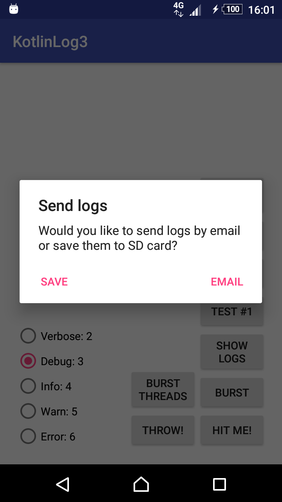

[](https://jitpack.io/#Qase/KotlinLogger)
[](https://travis-ci.org/Qase/KotlinLogger)
[](https://codebeat.co/projects/github-com-qase-kotlinlogger-master)
[](https://android-arsenal.com/api?level=16)
[](https://opensource.org/licenses/MIT)
[](mailto:vladislav.trnka@quanti.cz)
[](https://github.com/Qase/KotlinLogger)


## KotlinLogger

Smart android logger written in Kotlin language.

Mostly used in Prague based android development company - [Quanti](https://www.quanti.cz/) for everything. Product is still being actively developed.

## Features
* Usable in every JVM language including Java/Kotlin/Scala ...
* Very easy to use
* No more TAGs, but you can still use them
* Easy to extend using your own ILogger interface
* Lot of optional parameters
* Lightweight
* Possibility to print system info
* Send data to [Qase LoggingServer](https://github.com/Qase/LoggingServer)
* Every logged exception is logged to own separate file
* Sample [app](github/sampleApp.png) is ready to build


## Installation

Click [HERE](https://jitpack.io/#Qase/KotlinLogger).

## Code example

Usage is simple

1) Make sure you have set your applicationId in gradle 
```
android{
  defaultConfig{
    applicationId = "your.cool.app"
    ...
  }
  ...
}
```

2) Initialise `Log` and add all needed loggers. Every logger can be initialized using bundle or use default values.

```kotlin
// Log initialisation
Log.initialise(context)

//forwards all log to android logcat
val androidBundle = LoggerBundle(LogLevel.INFO)
Log.addLogger(AndroidLogger(androidBundle))

//default log level is warn
//apply plugins google-services and firebase.crashlytics, copy google-services.json in app/ directory
//download google-services.json from https://console.firebase.google.com/u/0/project/{project_id}/settings/general/android:{project_package}
//add these two lines in app/build.gradle
//  apply plugin: 'com.google.gms.google-services'
//  apply plugin: 'com.google.firebase.crashlytics'
Log.addLogger(CrashlyticsLogger())

//Every LogBundles has ton of options, see javadoc for more
//DayLogBundle logs every day to one separate log file
val dayLogBundle = DayLogBundle(maxDaysSaved = 4)
Log.addLogger(FileLogger(applicationContext, dayLogBundle))

//CircleLogBundle logs to one file until specified size is reached, but may overflow
val rotateBundle = CircleLogBundle(numOfFiles = 7)
Log.addLogger(FileLogger(applicationContext, rotateBundle))

//StrictCircleLogBundle logs to one file until specified size is reached, never overflows but slower
val strictRotateBundle = StrictCircleLogBundle(maxFileSizeMegaBytes = 1)  
Log.addLogger(FileLogger(applicationContext, strictRotateBundle))

//WebLogger logs to Qase LogServer using REST API or WebSockets
//Run your own server and then debug your application remotely
val restBundle = RestLoggerBundle("http://webserver/api/v1/")
val webSocketBundle = WebSocketLoggerBundle("ws://webserver/ws/v1/")
Log.addLogger(WebLogger(choose restBundle or webSocketBundle))

```


3) Then log as you would normally do - just using another dependency
(or log sync using Log.xSync methods)

```kotlin
Log.v("This");
Log.d("is");
Log.i("sample");
Log.i("text", "OWN TAG");
Log.i("that");
Log.i("will");
Log.iSync("be");
Log.w("logged.");
Log.e("wi", Exception()); //throwable
```

4) Other possibilities 
```kotlin
//Enable unchecked crash handling
Log.useUncheckedErrorHandler()

//Delete all logs
FileLogger.deleteAllLogs()

//Print system logs
Log.logMetadata(appContext)

//Use of SendLogDialogFragment
//It can send zip of logs to email or save to sd card 
//WRITE_EXTERNAL_STORAGE permission is needed if you want to save logs to sd card
SendLogDialogFragment.newInstance("your@email.com", deleteLogs = true).show(supportFragmentManager, "TAG")
```



## License
[MIT](https://github.com/nishanths/license/blob/master/LICENSE)
